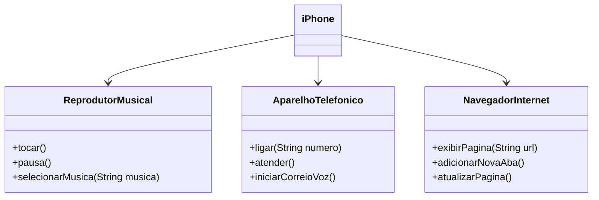

# POO-Desafio

### Diagrama UML (Mermaid)

```mermaid
classDiagram
direction TB
    class iPhone {
    }

    class ReprodutorMusical {
	    +tocar()
	    +pausa()
	    +selecionarMusica(String musica)
    }

    class AparelhoTelefonico {
	    +ligar(String numero)
	    +atender()
	    +iniciarCorreioVoz()
    }

    class NavegadorInternet {
	    +exibirPagina(String url)
	    +adicionarNovaAba()
	    +atualizarPagina()
    }

    iPhone --> ReprodutorMusical
    iPhone --> AparelhoTelefonico
    iPhone --> NavegadorInternet


```
